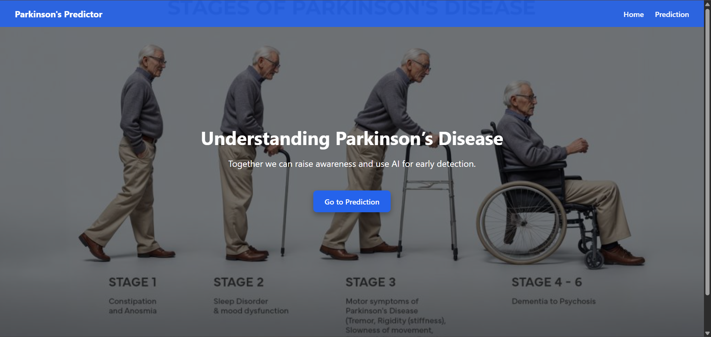
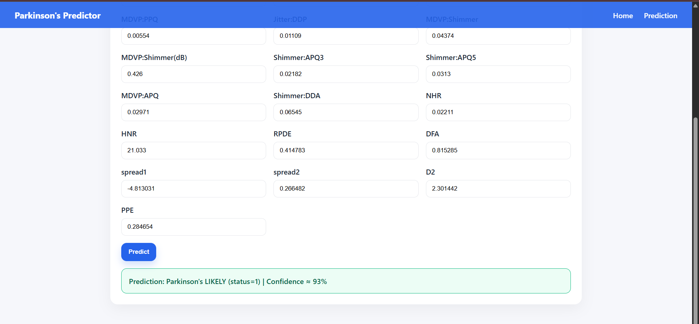
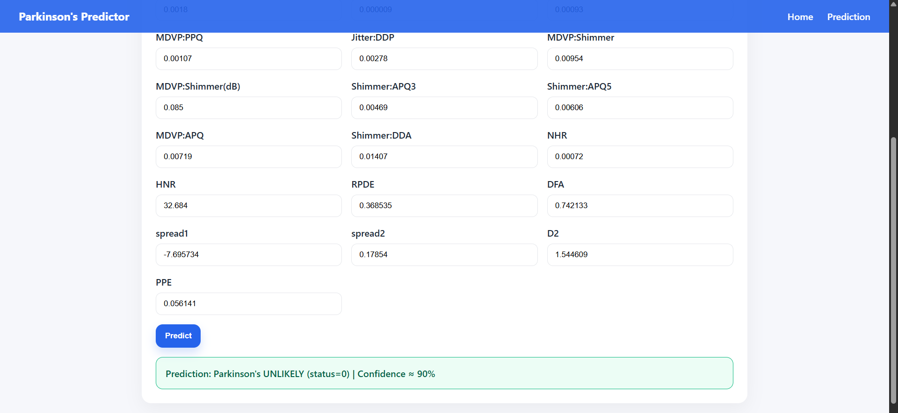

# 🧠 Parkinson's Disease Prediction Web App  

This project is a **Flask-based web application** that predicts the likelihood of Parkinson’s disease using **Machine Learning (SVM classifier)** trained on biomedical voice measurements.  

It helps in **early detection and awareness** by allowing users to enter biomedical parameters and get predictions.  

---

## 📌 Features
- Train a **Support Vector Machine (SVM)** model on the Parkinson’s dataset.  
- Flask-powered web app with:  
  - **Home Page** → Awareness and information.  
  - **Prediction Page** → Enter patient biomedical features to check Parkinson’s probability.  
- API returns:  
  - `prediction` (0 = Healthy, 1 = Parkinson’s).  
  - `probability` (confidence score).  

---

## ⚙️ Tech Stack
- **Backend** → Python, Flask  
- **Machine Learning** → Scikit-learn (SVM, StandardScaler)  
- **Frontend** → HTML, CSS (Bootstrap-like styling)  
- **Storage** → Pickle files (`model.pkl`, `scaler.pkl`)  

---

## 🖼️ Output Screenshots  

### 🔍 Home Page  
  

### 🎯 Prediction Result Example 
  

### 📊 Prediction Result Example  

## 📂 Project Structure
